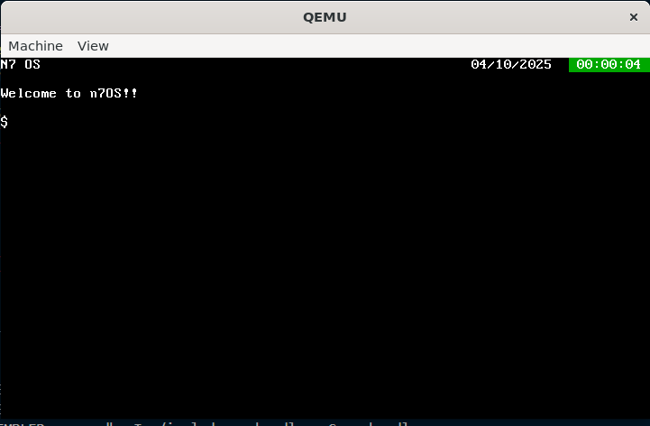

# Mini Operating System for x86 PCs



## Overview

This project consists of developing a mini operating system (n7OS) for x86 PCs, written in C and assembly.  
The goal is to understand and implement the core mechanisms of an operating system from scratch.

## Objectives

### What we will cover
- Basic I/O management (keyboard and screen)
- Interrupt handling
- Process management
- Virtual memory management for processes

### What we will not cover
- File system management
- Resource sharing and inter-process communication

## Covered topics

### Starter
- Console display  
- Interrupt management  
- System calls  

> Topics:
> - Console implementation  
> - write system call

### Main Course
- Timer management  
- Process creation and destruction  
- Scheduling and round-robin execution  

> Topics:
> - Timer interrupt  
> - Process scheduling and management

### Dessert
- Keyboard input  
- Command interpreter  

> Topics:
> - Keyboard reading and read system call  
> - Simple shell implementation

## Tools Setup

### Compilation
```bash
sudo apt-get install build-essential
```
### Execution
``` bash
sudo apt-get install qemu
```
### Debugging
``` bash
sudo apt-get install gdb
```
> GDB connects to QEMU to help detect and analyze potential issues.

> [!NOTE]
> Commands are for Debian and derivatives (I use Ubuntu). Adapt based on your Linux distribution.
> On Mac: Use x86 `gcc` tools via `macports` (package `i386-elf-gcc`).
## The Amuse-Bouches
### Project Structure
- `/boot`
  - Boot directory;
  - `crt0.S` initializes hardware and starts the main system program (`kernel_start`)
- `/kernel`
  - Kernel source directory
  - This is where most things will happen
- `/lib`
  - Some useful tools (e.g., `printf`)
- `/include`
  - For `.h` files

### Getting Started with the Environment

- Compilation via `make` command
  - If all goes well, result: `kernel.bin`
- Execution: `make run`
  - A QEMU window should appear
  - The system runs
- Debugging
  - Launch: `make dbg`
  - Set breakpoint at system start: `b kernel_start`
  - Run execution: `cont` or `r`
  - Display a variable: `display` variable name
  - `n`: Next, `s`: Step

## Usage
### Compilation
``` bash
make
```
> Result : `kernel.bin`

### Run
``` bash
make run
```
> A QEMU window should appear and the OS will start.

### Debugging
``` bash
make dbg
```
Then inside GDB:
``` nginx
b kernel_start     # Set breakpoint at system start
cont or r          # Run
display <variable> # Show variable value
n                  # Next
s                  # Step into
```

## Demo
### OS commands
```shell
help
```
> This command prints the available commands.
[help](./images/help.png)

### Runner Game
```shell
run runner
```
> This command starts the runner game.
[runner](./images/runner.png)

### Snake Game
```shell
run snake
```
> This command starts the snake game.
[snake](./images/snake.png)